# Innovatiespotter - Software Engineer Assignment

## Task 1: PHP Code Refactoring

### Errors Found in the provided code
1. **Missing Return Value:**
  - In cases of invalid data, the function did not return a value despite the declared return type of `?array` (line 10 breaks).
  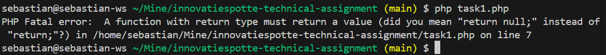

2. **Data validation:**
  - The `isCompanyDataValid()` function innitially checked for an array index (`$data[0]`) instead of using the required keys (like `'name'`) exist. Also added checks for address and website, supposing that they are required fields.
  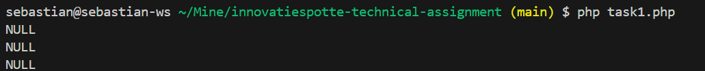

3. **Undefined variable:**
  - The original code uses `$cleanWebsite` in a regular expression check without initializing it. This causes a warning because PHP cannot find the variable's value.
  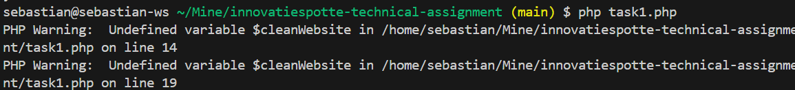

4. **Code readability:**
  - The provided code used inline conditional statements (ternary operators) in a way that reduced clarity.
  - If lacked braces.
  - The code lacked comments and PHPDoc blocks, making it harder to understand the purpose of each function and variable.
  - Name of variables are not meaningful.

### Procedure followed to fix the issues

- **Consistent Return Type:**  
  The function now explicitly returns `error` if the company data provided is invalid, acording with its declared return type.

- **Improved data validation:**  
  The validation method now checks for `name` ,`address` and `website`  key, ensuring that the object provided is of correct format.

- **Defined `$cleanWebsite`:**  
  The variable is now properly initialized by trimming the input from `$data['website']` before using it in any operations.

- **Improved readability:**  
  The refactored code is formatted with proper indentation, consistent use of braces, included detailed comments and PHPDoc blocks, changed name of the variables to be more meaningful and added extra validation.

- **Final output of the refactored code is:**
    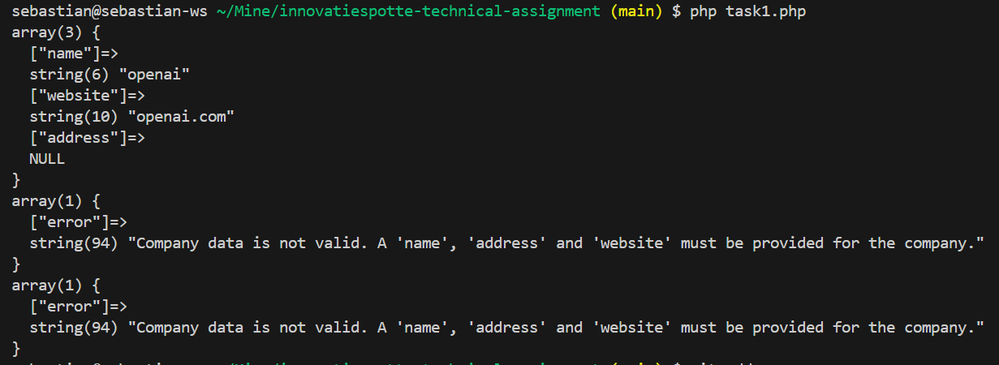

## Task 2: PostgreSQL
1. **DB innitialization and docker container**
  - The database was created using the `docker-compose.yml` file, which defines a PostgreSQL container with the required environment variables.
  - The database schema was created using the `init.sql` file, which contains the SQL commands to create the `companies` and `normalized_companies` tables and also inserted some test companies.
  - The `init.sql` file was mounted to the `/docker-entrypoint-initdb.d/` directory in the PostgreSQL container, such that the schema is created when the container starts.
  - The database connection variables were defined in the `.env` file to ensure secure docker container. (should be in the gitignore file but for this assignment it is included as demonstration)
  - Subjectiveley decided to manually load .env instead of third-party libraries such as dotenv.
  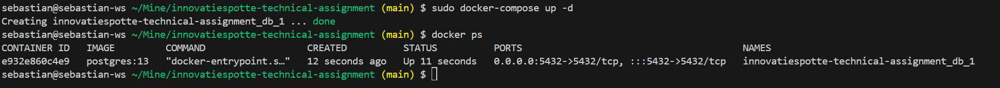
  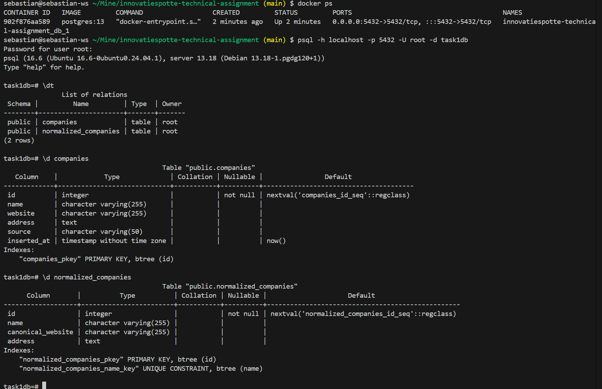

2. **Implement DB controller, queries.php and runQueries.php files**
  - The files are created following basic architectural principles, separating the database connection, queries, and execution logic. following the MVC pattern (without view as it is not needed for this assignment).
  - The `queries.php` file contains the SQL queries to interact with the database, such as inserting, updating, and selecting data from the `companies` and `normalized_companies` tables.
  - The `runQueries.php` file includes the necessary code to run the queries and display the results.
  - The singleton controller file `dbController.php` is used to connect to the database and execute the queries. (Implemented it as a singleton as shown in php documentation however later found out that in PHP singletons are not used)
  - For testing purposes 6 entries where inserted into companies table, 3 being dupplication of first 3. In the following figure we can see the state of the database after running the `runQueries.php` file.
  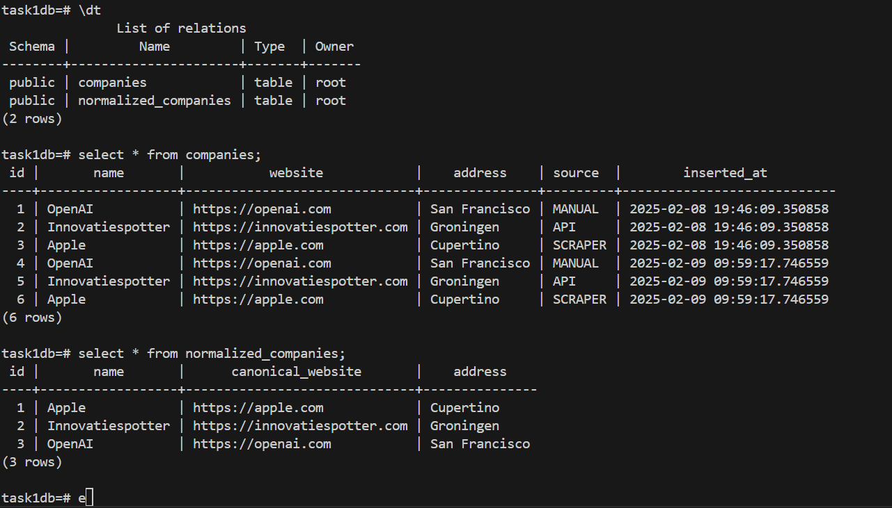
  - An the output after running the queries:
    - Duplicate query:
    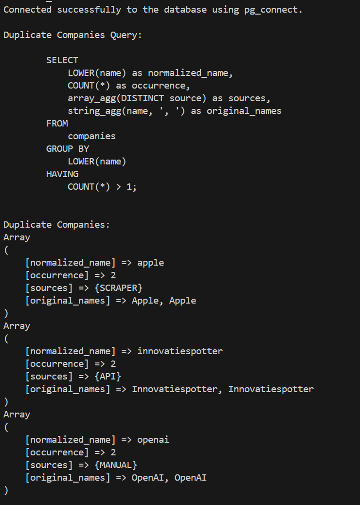
    - Stats query:
    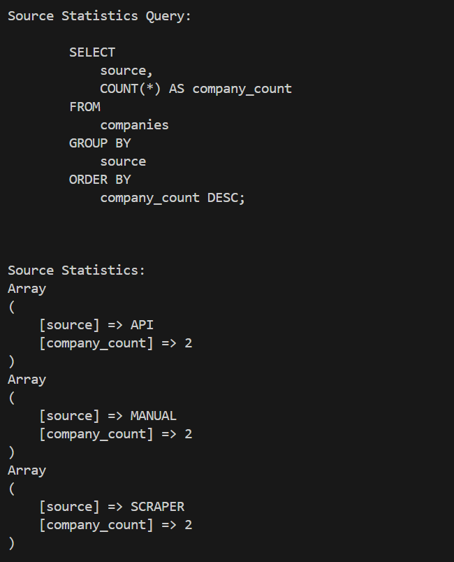
    - Normalize query:
    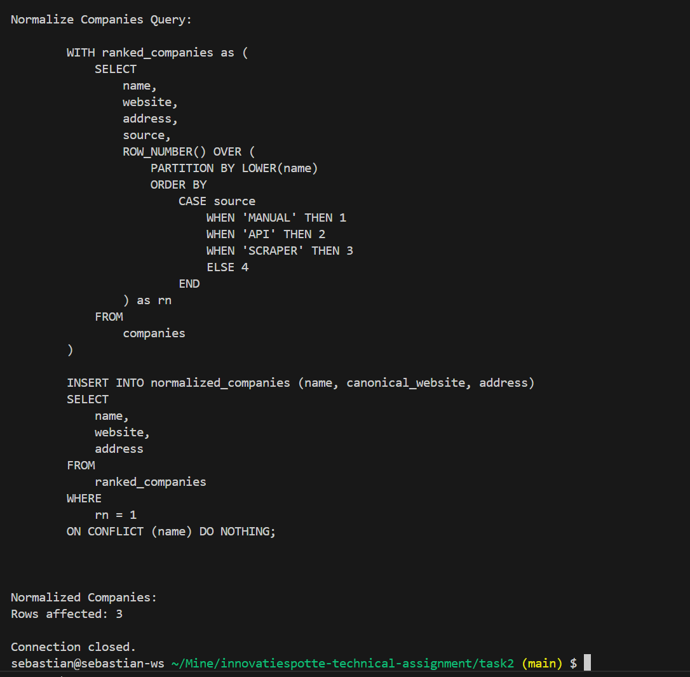

## Task 3: Node function to fetch data from API's
  - For this task the file fetchData.js in task3 folder was created. This file contains a function that fetches data from the provided API's combines their output, logs the combination and saves it into a combinedData.json file. 
  - The function uses the `axios` library to make HTTP requests to the API's(No need for AbortController as it has built in feature, cleaner code) and the `fs` module to write the combined data to a file.
  - The function is asynchronous and uses `Promise.allSettled()` to fetch data from API's concurrently. Using `allSettled` instead of `all` so that the outcome 
  all promises is known and all promises are executed. If one fails the error is not handled immediatly.
  - The function logs the combined data to the console and writes it to a file named `combinedData.json`.
  - The function was tested by running the `fetchData.js` file using Node.js.
  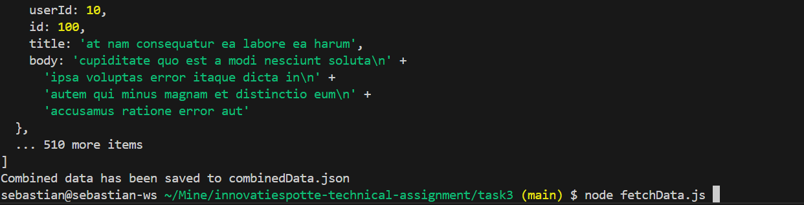

## Sources and References
- [PHP Documentation](https://www.php.net/docs.php)
- [PostgreSQL Documentation](https://www.postgresql.org/docs/)
- [JavaScript Documentation](https://developer.mozilla.org/en-US/docs/Web/JavaScript)
- [Axios Documentation](https://axios-http.com/docs/intro)
- [File System (fs) Documentation](https://nodejs.org/api/fs.html)
- [Promise.allSettled() Documentation](https://developer.mozilla.org/en-US/docs/Web/JavaScript/Reference/Global_Objects/Promise/allSettled)
- [Docker Documentation](https://docs.docker.com/)
- [Docker Compose Documentation](https://docs.docker.com/compose/)
- For syntax correction of php code: [PHP The Right Way](https://phptherightway.com/) with OpenAI model o3-mini 
- For debugging [StackOverflow](https://stackoverflow.com/questions/4595964/is-there-a-use-case-for-singletons-with-database-access-in-php) and php documentation was used alongside with OpenAI model o3-mini.
- For architecture of the code, MVC pattern was used as a 
[Reference](https://www.martinfowler.com/architecture/)
